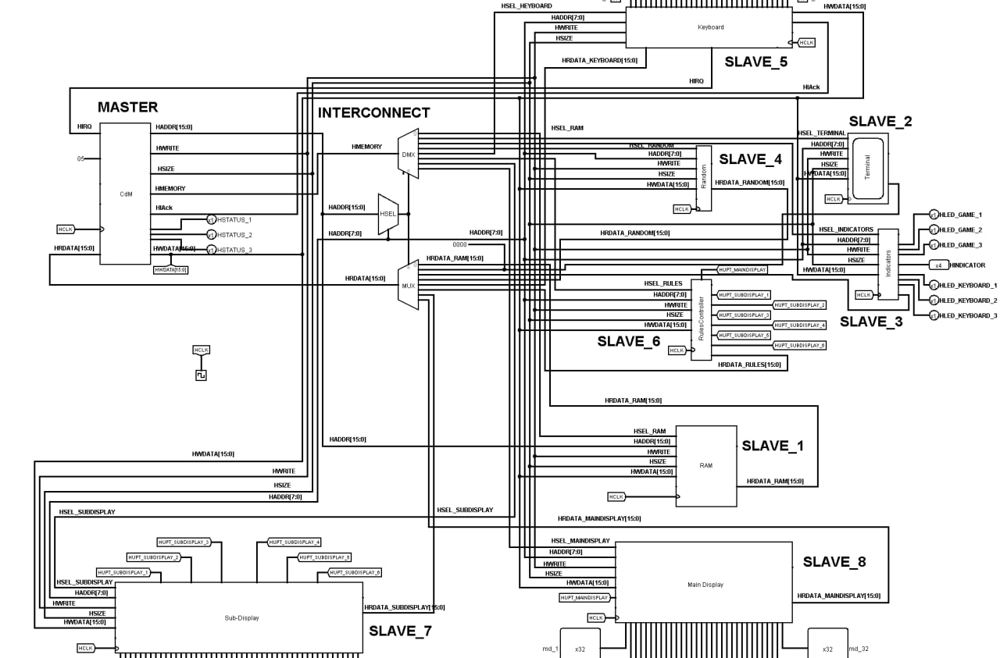
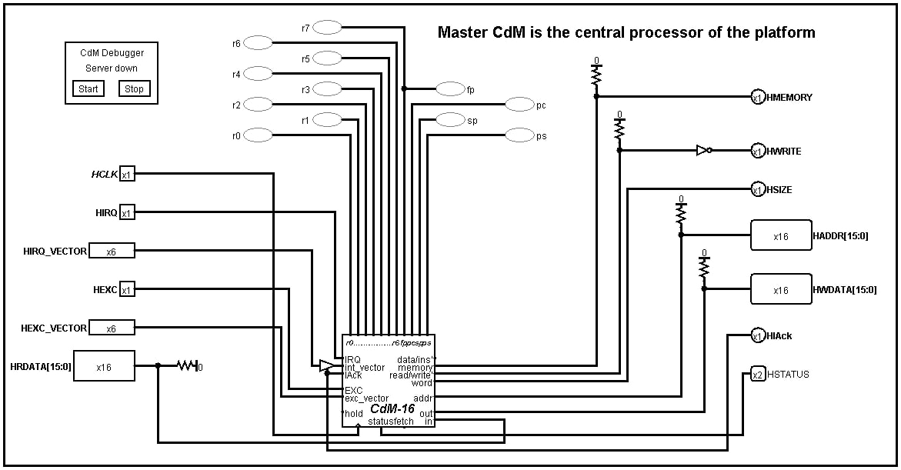
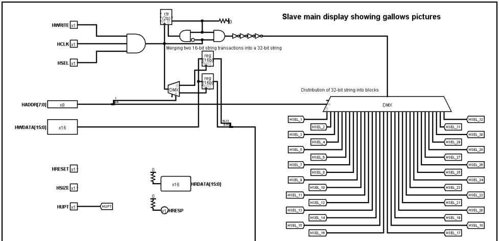
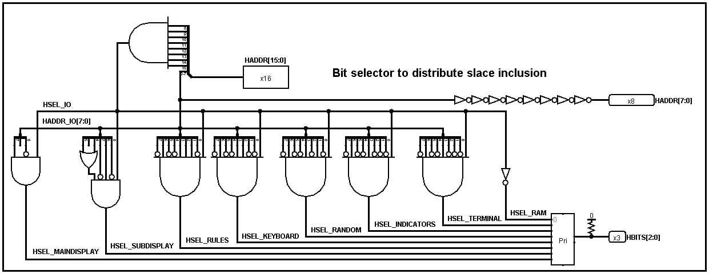

# CdM16 × AMBA AHB-Lite Demo Platform

Hands-on digital-design playground powered by a 16-bit CdM CPU and a full AMBA AHB-Lite bus.

---

## ❓ Why this project?

> *"Stop teaching bus interfaces with toy protocols."*
> — someone in our digital-logic class, probably.

* 🏭 **Industrial standard.** AMBA AHB-Lite is what real chips speak; no cut corners.
* 🛠️ **Open tooling.** Runs entirely in Logisim + a few open-source plugins.
* 🍔 **Full stack.** From Verilog-style schematics → assembly code → playable game.

All the gory details live in the repo so you can **clone, run, and hack away**.

---

## 🛠️ Hardware overview

| Block                         | Function                                     |
| ----------------------------- | -------------------------------------------- |
| **Master — CdM16 CPU**        | 16-bit RISC core provided by the university. |
| **Interconnect_BitSelector**  | Custom address decoder / HSEL generator.     |
| **Slave 0 – RAM**             | 64 kB unified program + data memory.         |
| **Slave 1 – MainDisplay**     | 32 × 32 bitmap "gallows" canvas.             |
| **Slave 2 – SubDisplay**      | 32 × 8 text line for guessed letters.        |
| **Slave 3 – RulesController** | Freeze / refresh logic for both displays.    |
| **Slave 4 – Terminal**        | Debug console (mapped to `0xFF46`).          |
| **Slave 5 – Indicators**      | 3-LED status cluster (green / yellow / red). |
| **Slave 6 – Random**          | LFSR-based RNG for word selection.           |
| **Slave 7 – Keyboard**        | 33-key RU-layout matrix → IRQ 5.             |

 

---

## 🗺️ Memory map

| Address range     | Size   | Slave               | Notes          |
| ----------------- | ------ | ------------------- | -------------- |
| `0x0000 – 0xFEFF` | 0xFF00 | **RAM**             | Code + data    |
| `0xFF46`          | 1 word | **Terminal**        | R/W            |
| `0xFF48`          | 1 word | **Indicators**      | W              |
| `0xFF4A`          | 1 word | **Random**          | R              |
| `0xFF4C`          | 1 word | **Keyboard**        | R (clears IRQ) |
| `0xFF4E`          | 1 word | **RulesController** | W              |
| `0xFF50 – 0xFF7F` | 0x30   | **SubDisplay**      | W              |
| `0xFF80 – 0xFFFF` | 0x80   | **MainDisplay**     | W              |

All peripherals are memory-mapped; **no special I/O instructions required**.

---

## 🔔 Interrupts

| Vector | Source           | Purpose            |
| ------ | ---------------- | ------------------ |
| 0      | **Reset / Main** | Program entry      |
| 1–4    | *Reserved*       | Fault traps        |
| **5**  | **Keyboard**     | User keypress      |
| 6–15   | *Available*      | Extend as you like |

Enable interrupts in the status register and you're good. ⚡

---

## 🎮 Demo application — Hangman 🪢

* 256 Russian 6-letter words, LZ-packed in ROM.
* RNG picks a secret word, game logic lives in `src/asm/main.asm`.
* Display updates use double-buffer & freeze-refresh via RulesController.
* No external dependencies beyond the supplied JAR plugins.
